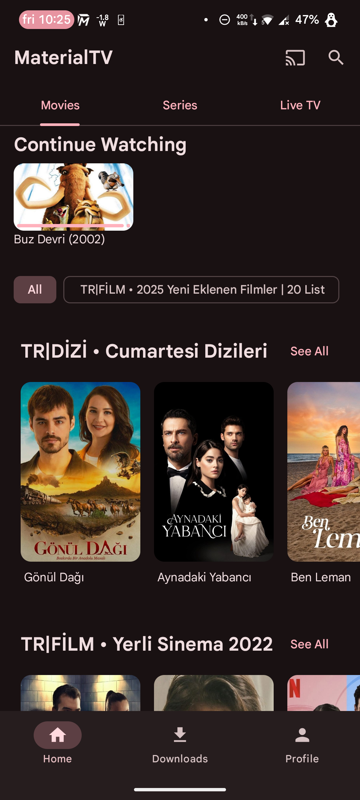
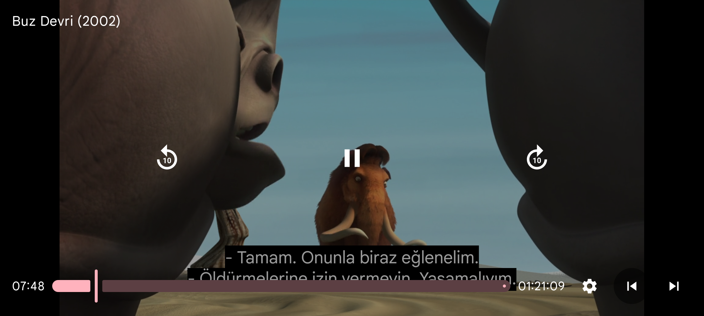
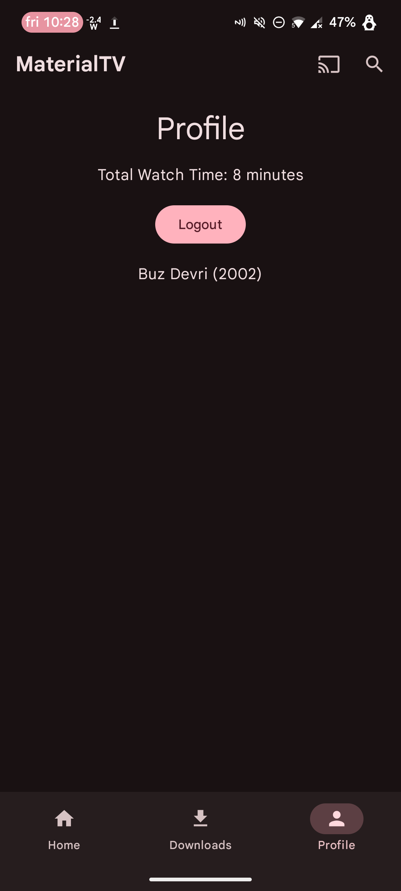

# MaterialTV


MaterialTV is a modern IPTV / VOD (Video on Demand) player developed for the Android platform, adhering to Material Design 3 principles. It supports the XTream API infrastructure, allowing users to access and watch their own media content.

## 🖼️ Screenshots

| Home Screen | Player Screen | Profile Screen |
| :---: | :---: | :---: |
|  |  |  |

## ✨ Features

* **XTream API Support:** Log in with multiple profiles (user accounts).
* **Modern Interface:** A clean and fluid user experience designed with Material Design 3.
* **Profile Screen:** Manage user information, account expiration dates, and settings.
* **About Section:** View application version and recent updates.
* **Categories:** Live TV, Movies, and Series (with Season/Episode support).
* **Advanced Player:** A powerful and stable video player based on `androidx.media3 (ExoPlayer)`.
* **Download Content:** A download feature for watching movies and episodes offline.
* **Broad Codec Support:** Flawless playback of difficult formats like `mp4v-es`, thanks to `media3-ffmpeg-decoder` (Jellyfin/Phaedra fork) integration.
* **Advanced Controls:**
    * Next / Previous episode buttons.
    * Smooth seek (scrubbing) functionality, even when the video is paused.
* **Keep Screen On:** Prevents the screen from turning off automatically while watching a video (`FLAG_KEEP_SCREEN_ON`).

## 🛠️ Tech Stack & Architecture

* **Primary Language:** [Kotlin](https://kotlinlang.org/)
* **Core Philosophy:** Single-Activity, MVVM Architecture
* **Asynchronous:** Kotlin Coroutines & Flow
* **Media Player:** [AndroidX Media3 (ExoPlayer)](https://developer.android.com/guide/topics/media/media3)
* **Video Codec:** [media3-ffmpeg-decoder](https://github.com/jellyfin/media3-ffmpeg-decoder) (For broad format support)
* **Networking:** Retrofit & OkHttp (For XTream API communication)
* **JSON Parsing:** kotlinx.serialization (To safely parse inconsistent JSON data from the API)
* **User Interface (UI):** XML & Material Design 3 Components
* **Database:** Room (For downloaded content and user profiles)

## 🚀 Building the Project

1.  Clone this repository to your local machine:
    ```sh
    git clone [https://github.com/hasan-ege/MaterialTV.git](https://github.com/hasan-ege/MaterialTV.git)
    ```
2.  Open the project in Android Studio (Preferably the latest version, e.g., Hedgehog or Iguana).
3.  Wait for the Gradle synchronization to complete.
4.  Build and run the project.

## 🤝 Contributing

Contributions are welcome! If you find a bug or want to suggest a new feature, please open an **Issue** or submit a **Pull Request**.

1.  Fork the Project.
2.  Create your Feature Branch (`git checkout -b feature/NewFeature`).
3.  Commit your Changes (`git commit -m 'Add: NewFeature'`).
4.  Push to the Branch (`git push origin feature/NewFeature`).
5.  Open a Pull Request.

## 📄 License


This project is licensed under the [MIT License](LICENSE.md). See the `LICENSE.md` file for details.


